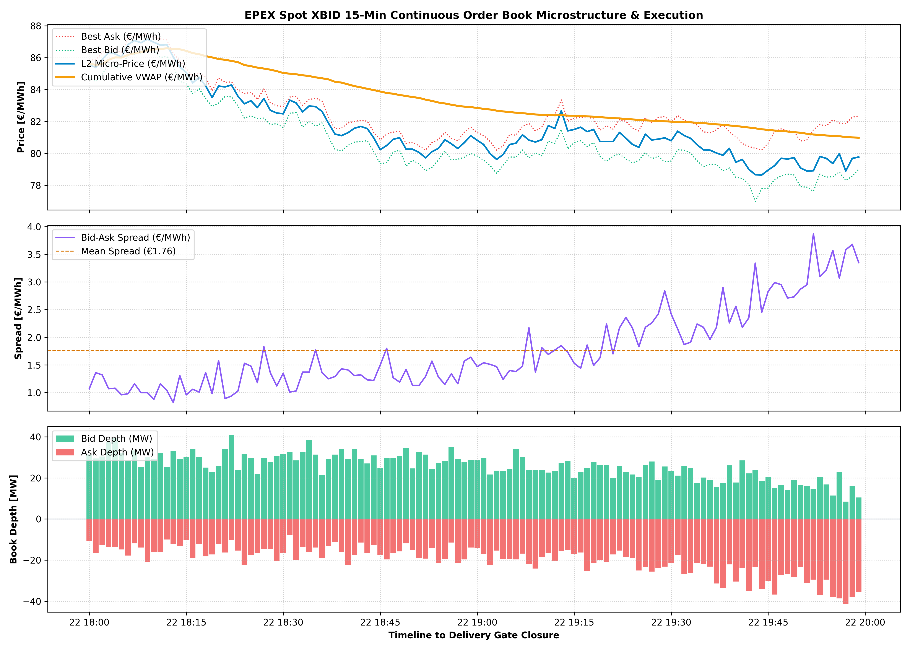

# ⚡ Intraday Continuous Trading & Order Book (XBID) Microstructure Engine

> **Quantitative market microstructure and execution benchmark framework modeling Level-2 order book dynamics, Order Flow Imbalance (OFI), micro-price drift, and VWAP execution for German 15-minute intraday continuous power contracts (EPEX Spot / XBID).**

[](https://www.python.org/downloads/)
[](https://www.epexspot.com/en/market-data)
[](https://opensource.org/licenses/MIT)
[](https://intraday-xbid-microstructure-engine-hhwyltmw8ypwzz2eker2be.streamlit.app/)

---

## 📊 Dashboard & Execution Preview



---

## 📌 Problem Context & Objectives

In European power trading (EPEX Spot / SIDC XBID), balancing responsible parties (BRPs) actively rebalance physical positions using **15-minute continuous contracts** to eliminate wind and solar forecast errors ahead of delivery gate closure ($T-30$ min in Germany).

As delivery approaches, order books experience structural microstructure phenomena:
* **Liquidity Concentration & Urgency**: Trading intensity rises exponentially in the final hour before gate closure.
* **Order Flow Imbalance (OFI)**: Asymmetries between limit bid and ask queues exert immediate short-term directional pressure on prices.
* **Execution Slippage**: Aggressive market orders incur non-linear execution slippage against the prevailing bid-ask spread.

This engine simulates and quantifies these dynamics to evaluate algorithmic execution performance against **Volume-Weighted Average Price (VWAP)** and **L2 Micro-Price** benchmarks.

---

## 🔬 Mathematical Formulation

### 1. Level-2 Micro-Price
Weighted by instantaneous queue depth at the top of the book:

$$P_{\text{micro}}(t) = \frac{P_{\text{bid}}(t) \cdot Q_{\text{ask}}(t) + P_{\text{ask}}(t) \cdot Q_{\text{bid}}(t)}{Q_{\text{bid}}(t) + Q_{\text{ask}}(t)}$$

### 2. Normalized Order Flow Imbalance (OFI)
Captures instantaneous queue pressure in the range $[-1, +1]$:

$$\text{OFI}(t) = \frac{Q_{\text{bid}}(t) - Q_{\text{ask}}(t)}{Q_{\text{bid}}(t) + Q_{\text{ask}}(t)}$$

### 3. Volume-Weighted Average Price (VWAP)
Standard execution benchmark across discrete matched trade prints:

$$\text{VWAP}_T = \frac{\sum_{t=1}^{T} P_{\text{trade}}(t) \cdot V_{\text{trade}}(t)}{\sum_{t=1}^{T} V_{\text{trade}}(t)}$$

### 4. Gate Closure Urgency & Arrival Dynamics
Trading intensity $\lambda(t)$ scales inversely with time-to-gate ($\tau$):

$$\lambda(t) = \lambda_0 \cdot \exp\left(-\frac{\tau}{\tau_{\text{decay}}}\right)$$

---

## 📂 Repository Architecture

```text
intraday-xbid-microstructure-engine/
│
├── .github/
│   └── workflows/
│       └── ci.yml               # Automated PyTest CI/CD pipeline
├── src/
│   ├── __init__.py
│   ├── microstructure_model.py  # OFI, Micro-price & spread calculations
│   └── orderbook_simulator.py   # L2 continuous order book dynamics
├── tests/
│   ├── __init__.py
│   └── test_microstructure.py   # Microstructure boundary test suites
├── app.py                       # Interactive Streamlit execution terminal
├── xbid_simulation.py           # Standalone simulation & quantitative plot script
├── intraday_xbid_simulation_results.png # Visual benchmark plot
├── requirements.txt
├── README.md
└── .gitignore
